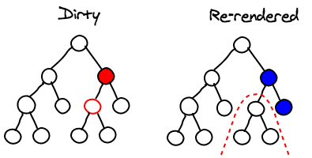

## Diff 算法

diff 算法作为 Virtual DOM 的加速器，其算法的改进优化是 React 整个界面渲染的基础和性能的保障，同时也是 React 源码中最神秘的，最不可思议的部分

diff 算法会帮助我们就散出 VirtualDOM 中真正变化的部分，并只针对该部分进行原生 DOM 操作，而不是渲染整个页面。从而保证了每次操作更新后页面的高效渲染。

### 传统的 diff 算法

计算一棵树形结构转换为另一棵树形结构需要最少步骤，如果使用传统的 diff 算法通过循环递归遍历节点进行对比，其复杂度要达到 *O(n^3)*，其中 n 是树中节点总数，效率十分低下，假设我们要展示1000个节点，那么我们就要依次执行上十亿次的比较。

```js
// traditional diff algorithm
let res = []
// 比较子节点
const diffLeafs = function (beforeLeaf, afterLeaf) {
    // 获取较大节点树的长度
    let count = Math.max(beforeLeaf.children.length, after.children.length)
    // 循环遍历
    for (let i = 0; i < count; i++) {
        const beforeTag = beforeLeaf.children[i]
        const afterTag = afterLeaf.children[i]
        if (beforeTag === undefined) {	// 添加 afterTag 节点
            res.push({type: 'add', element: afterTag})
        } else if (afterTag === undefined) {// 删除 beforeTag节点
            res.push({type: 'remove', element: beforeTag})
        } else if (beforeTag.tagName !== afterTag.tagName) {// 节点名改变时,删除 beforeTag 节点,添加 afterTag 节点
            res.push({type: 'remove', element: beforeTag})
            res.push({type: 'add', element: afterTag})
        } else if (beforeTag.innerHTML !== afterTag.innerHTML) {
            if (beforeTag.children.length === 0){
                res.push({
                    type: 'changed',
                    beforeElement: beforeTag,
                    afterElement: afterTag,
                    html: afterTag.innerHTML
                })
            } else {
                // 递归比较
                diffLeafs(beforeTag, afterTag)
            }
        }
    }
    return res
}
```

### React diff 算法

React 将 Virtual DOM 树转换为 Actual DOM 的最少操作过程称为调和（Reconciliation），diff 算法便是调和的具体实现。

React 通过制定大胆的策略，将 *O(n^3)* 复杂度的问题转换成 *O(n)* 复杂度的问题。

#### diff策略

- Web UI 中DOM节点跨层级的移动操作特别少，可以忽略不计
- 拥有相同类的两个组件将会生成相似的树形结构，拥有不同类的两个组件将会生成不同的树形结构。
- 对于同一层级的一组子节点，它们可以通过唯一ID进行区分。

基于以上三个前提策略，React 分别对 **tree diff**、**component diff**、**element diff** 进行算法优化，事实也证明这三个前提策略是合理且准确的，它保证了整体界面构建的性能。 

#### Tree Diff 按照层级

基于策略一，React 对树的算法进行了简洁明了的优化，即对树进行分层比较，两棵树只会对同一层次的节点进行比较。

既然 WebUI 中的 DOM 节点跨层级的移动操作少到可以忽略不计，针对这一现象，React 通过 updateDepth 对 Virtual DOM 树进行层级控制，只会对相同颜色方框内的 DOM 节点进行比较，即同一个父节点下的所有子节点。当发现节点已经不存在，则该节点及其子节点会被完全删除掉，不会用于进一步的比较。这样只需要对树进行一次遍历，便能完成整个 DOM 树的比较。


**Q：当 DOM 节点进行跨层级操作时，diff 会有怎样的表现呢？**

如下图所示，A 节点（包括其子节点）被整个移动到 D 节点下面去，由于 React 只会简单的考虑同级节点的位置变换，而对于不同层级的节点，只有创建和删除操作，所以当根节点发现 A 节点消失了，就会删除 A 节点及其子节点，当 D 发现多了一个子节点 A，就会创建新的 A 作为其子节点。

此时，diff 算法的执行情况是：**createA => createB => createC => deleteA**


由此可见，当出现节点跨层级的移动时，并不会出现想象中移动操作，而是会进行删除，重新创建的动作，这是一种很影响 React 性能的操作。因此 **React 官方也不建议进行 DOM 节点跨层级的操作。**

提示：在开发组件时，保持稳定的 DOM 结构会有助于性能的提升。例如，可以通过 CSS 隐藏或显示节点，而不是真的移除或添加 DOM 节点。

#### Component Diff

React 是基于组件构建应用的，对于组件间的比较所采用的策略也是非常简洁和高效的。

- 如果是同一个类型的组件，则按照原策略继续进行 Virtual DOM 比较
- 如果不是同一类型的组件，则将该组件判断为 `dirty component`，从而替换整个组件下的所有子节点
- 如果是同一个类型的组件，有可能经过一轮 Virtual DOM 比较下来，并没有发生变化。如果我们能够提前确切知道这一点，那么就可以省下大量的 diff 运算时间。因此，React 允许用户通过 `shouldComponentUpdate()` 来判断该组件是否需要进行 diff 算法分析

如下图所示， 当 component D 变为 component G时，即使这两个 component 结构相似，一旦 React 判断 D 和 G 是不同类型的组件，就不会比较两者的结构，而是直接删除组件 component D，重新创建 component G及其子节点。虽然当两个组件是不同类型但结构相似时，进行 diff 算法分析会影响性能，但是毕竟不同类型的组件存在相似 DOM 树的情况在实际开发过程中很少出现，因此这种极端因素很难在实际开发过程中造成重大影响。


#### Element Diff

当节点属于同一层级时，diff 提供了三种节点操作，分别为 **`INSERT_MARKUP`（插入）**、**`MOVE_EXISTING`（移动）**和 **`REMOVE_NODE`（删除）**。

- **`INSERT_MARKUP`**：新的组件类型不在旧集合中，即全新的节点，需要对新节点进行插入操作。
- **`MOVE_EXISTING`**：旧集合中有新组件类型，且 `element` 是可更新的类型，generateComponent 已调用 recevieComponent，这种情况下 `prevChild = nextChild`，这时候就需要做移动操作，可以复用以前的 DOM 节点。
- **`REMOVE_NODE`**：旧组件类型，在新集合里也有，但对应的 `element` 不同则不能直接复用和更新，需要执行删除操作，或者旧组件不在新集合里的，也需要执行删除操作。


React 提出优化策略：**允许开发者对同一层级的同组子节点，添加唯一 key 进行区分**，虽然只是小小的改动，性能上却发生了翻天覆地的变化。


### 渲染

#### 合并操作

当调用 component 的 setState 方法的时候，React 将其标记为 dirty，到每一个事件循环结束，React 检查所有标记 dirty 的 component 重新绘制。

这里的“合并操作”是指，在一个事件循环当中，DOM 只会被更新一次，这个特性是构建高性能应用的关键，而且用通常的 JavaScript 代码难以实现，而在 React 应用里，你默认就能实现。


#### 子树渲染

调用 `setState` 方法时，component 会重新构建包括子节点的 Virtual DOM。如果你在根节点调用 `setState`，整个 React 的应用都会被重新渲染。所有的 component 即便没有更新，都会调用他们的 `render` 方法。这个听起来可怕，性能貌似很低，但实际上我们不会触碰真实的 DOM，运行起来没那样的问题。

首先，我们讨论的是展示用户界面。因为屏幕空间有限，通常你需要一次渲染成百上千条指令，JavaScript 对于能处理的整个界面，在业务路基上已经足够快了。

令一点，在写 React 代码时，每当有数据更新，你不是都调用根节点的 `setState`。你会在需要接收对应更新的 component 上调用，或者在上面的几个 component。你很少要一直在根节点上，就是说界面更新只出现在用户产生交互的局部。


#### 选择性子树渲染

最后，你还有可能去掉一些子树的重新渲染。如果你在 component 上实现以下方法的话：

```js
boolean shouldComponentUpdate(object nextProps, object nextState)
```

根据 component 的前一个和下一个 `props/state`，你可以告诉 React 这个 component 没有更新，也不需要重新绘制，实现得好的话，可以带来巨大的性能提升。

要用这个方法，你要能够对 JavaScript Object 进行比对，这样有很多细节的因素，比如对比应该是深度的还是浅层的。如果要深的，我们是用不可变数结构，还是进行深度拷贝。

而且你要注意，这个函数每次都会被调用，所以你要确保运行起来花的时间更少，比 React 的做法时间少，还有比计算 component 需要的时间少，即使重新绘制并不是必要的。



### 总结

- React 通过制定大胆的 diff 策略，将 *O(n^3)* 复杂度的问题转换成 *O(n)* 复杂度的问题
- React 通过分层求异的策略，对 tree diff 进行算法优化
- React 通过相同类生成相似树形结构，不同类生成不同树形结构的策略，对 component diff 进行算法优化
- React 通过设置唯一 key 的策略，对 element diff 进行算法优化
- 建议，在开发过程中，保持稳定的 DOM 结构会有助于性能的提升
- 建议，在开发过程中，尽量减少类似将最后一个节点移动到列表首部的操作，当节点数量过大或更新操作过于频繁时，在一定程度上会影响 React 的渲染性能

### 结论

帮助 React 变快的技术并不新颖，长久以来，我们知道触碰 DOM 是费时的，你应该合并处理读和写的操作，事件代理会更快。

人们还是会经常讨论他们，因为在实际当中用 JavaScript 进行实现还是挺难的，React 突出的一个原因是这些优化默认就启动了，这就让你避免掉不小心把 App 写得很慢。

React 消耗性能的模型很简单，很好理解：每次调用 `setState` 会重新计算整个子树。如果你想要提高性能，尽量少调用 `setState`，还有用 `shouldComponentUpdate` 减少大的子树的重新计算。

---

深入研究：

- [React Diff算法浅析](https://blog.csdn.net/qq_26708777/article/details/78107577?utm_source=blogxgwz6)
- [React的diff算法](https://segmentfault.com/a/1190000000606216)
- [React源码剖析系列——不可思议的 react diff](https://zhuanlan.zhihu.com/p/20346379)
- [React源码分析——Diff算法](https://juejin.im/post/5aa163df518825557b4c4f0a)