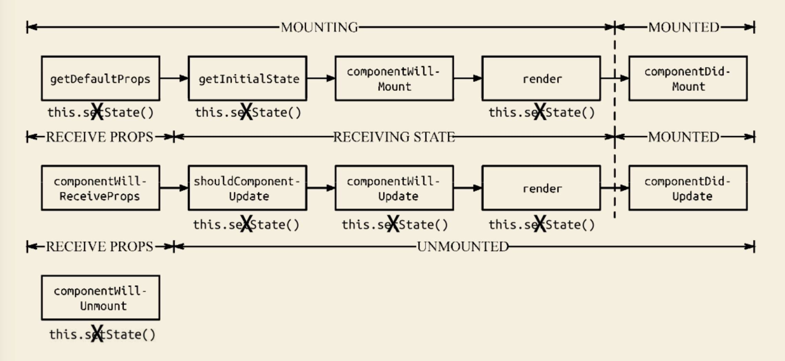

## setState

> `setState()` enqueues changes to the component state and tells React that this component and its children need to be re-rendered with the updated state. This is the primary method you use to update the user interface in response to event handlers and server responses.
>
> `setState()` 将需要处理的变化塞入（译者注：setState 源码中将一个需要改变的变化存放到组件的state对象中，采用队列处理）组件的 state 对象中， 并告诉该组件及其子组件需要用更新的状态来重新渲染。这是用于响应事件处理和服务端响应的更新用户界面的主要方式。

官方文档关于 `setState` 的描述部分：[英文文档](https://reactjs.org/docs/react-component.html#setstate) [中文文档](http://react.yubolun.com/docs/react-component.html#setstate)

为了提高框架性能，React 将 setState 设置为**状态批量处理或推迟更新**，实际上就是**异步操作函数**，该方法不会以顺序控制流的方式处理相同周期内的事件，同时，我们也不能依赖 `this.state` 用于计算未来状态。

### 基本语法

```js
Component.prototype.setState(updater [, callback])
```

| 参数     | 说明     | 类型               |
| -------- | -------- | ------------------ |
| updater  | 更新器   | object \| function |
| callback | 回调函数 | function           |

#### updater参数

##### 函数形式

`updater` 参数可为一个带签名的函数。

```js
Component.prototype.setState((prevState, props) => stateChange)
```

| stateChange参数 | 说明                                         | 类型 |
| --------------- | -------------------------------------------- | ---- |
| prevState       | 未更新前状态的引用。该引用不应该被直接改变。 | obj  |
| props           | 父组件传入的属性                             | obj  |

`updater` 函数接收到的 `prevState` 和 `props` 保证都是最新的。

该函数通过对 `prevState` 或 `props` 的引用构建一个新对象作为输出，该输出后续用于与旧状态（prevState）浅合并。

```js
// Example
this.setState((prevState, props) => {
    return {
        index: prevState.index + props.step
    }
})
```

##### 对象形式

`updater` 参数亦可为对象类型，该对象仅会浅合并到新状态中。

```js
Component.prototype.setState(obj stateChange, [callback])
```

与函数形式相类似，对象形式的 `updater` 参数通过直接构建与旧状态浅合并的新对象作为输出。

```js
// Example
this.setState({
    index: 1
})
```

#### callback参数

`callback` 参数为可选的回调函数，该函数会在状态（State）更新完成同时组件被重新渲染之后执行。通常，对于此类逻辑，官方推荐使用 `componentDidUpdate` 生命周期函数。

### 最佳实践

- [相同周期多次调用](#相同周期多次调用)
- 同步更新策略
  - [完成回调](#完成回调)
  - [传入状态计算函数](#传入状态计算函数)

#### 相同周期多次调用

当相同周期内多次调用 `setState()` 以更新相同的状态时，这些调用可能会被合并在一起。

设想有一个需求，需要在 `onClick` 里累加两次。

```js
onClick = () => {
	this.setState({ index: this.state.index + 1 });
    this.setState({ index: this.state.index + 1 });
}
```

当 React 对代码进行解析时，会对上述代码作以下解析：

```js
Object.assign(
	previousState,
	{index: state.index + 1},
	{index: state.index + 1},
	...
)
```

由于后面的数据会覆盖前面的更改，所以最终只加了一次。所以如果是下一个 State 的更新依赖前一个 State 的情况下，推荐 `setState()` 的  `updater` 参数使用函数形式传入。

```js
onClick = () => {
    this.setState((prevState, props) => {
      return {quantity: prevState.quantity + 1};
    });
    this.setState((prevState, props) => {
      return {quantity: prevState.quantity + 1};
    });
}
```

#### 同步更新策略

由于 `setState` 采取异步批量更新策略，而实际业务中某些场景需要用到同步更新逻辑。

案例：从服务端请求数据并且渲染到页面后，隐藏加载进度条或者外部加载提示 [原文](https://zhuanlan.zhihu.com/p/24781259)

```js
componentDidMount() {
    fetch('https://example.com')
        .then((res) => res.json())
        .then(
            (something) => {
                this.setState({ something });
                StatusBar.setNetworkActivityIndicatorVisible(false);
            }
        );
}
```

因为 `setState` 函数并不会阻塞等待状态更新完毕，因此 `setNetworkActivityIndicatorVisible` 有可能先于数据渲染完毕就执行。我们可以选择在 `componentWillUpdate` 与 `componentDidUpdate` 这两个生命周期的回调函数中执行 `setNetworkActivityIndicatorVisible`，但是会让代码变得破碎，可读性也不好。

实际上在项目开发中我们更频繁遇见此类问题的场景是通过某个变量控制元素可见性：

```js
this.setState({
    showForm: !this.showForm
})
```

我们预期的效果是每次事件触发后改变表单的可见性，但是在大型应用程序中如果事件的触发速度快于 `setState` 的更新速度，那么我们的值计算完全就是错的。本节就是讨论两种方式来保证 `setState` 的同步更新。

##### 完成回调

`setState` 函数的第二个参数允许传入回调函数，**在状态更新完毕后进行调用**。

```js
this.setState({
    load: !this.state.load,
    count: this.state.count + 1
},() => {
    console.log(this.state.count)
    console.log('加载完成')
})
```

这里回调函数用法相信大家很熟悉，就是 JavaScript 异步编程相关知识，我们可以引用 Promise 来封装 setState：

```js
setStateAsync(state) {
	return new Promise((resolve) => {
		this.setState(state, resolve)
	});
}
```

setStateAsync 返回的是Promise对象，在调用时我们可以使用Async/Await语法来优化代码风格：

```js
async componentDidMount() {
    StatusBar.setNetworkActivityIndicatorVisible(true)
    const res = await fetch('https://api.ipify.org?format=json')
    const {ip} = await res.json()
    await this.setStateAsync({ipAddress: ip})
    StatusBar.setNetworkActivityIndicatorVisible(false)
}
```

这里我们就可以保证在 setState 渲染完毕之后调用外部状态栏将网络请求状态修改为已结束，整个组件的完整定义为：

```jsx
class AwesomeProject extends Component {
  state = {}
  setStateAsync(state) {
    ...
  }
  async componentDidMount() {
   ...
  }
  render() {
    return (
      <View style={styles.container}>
        <Text style={styles.welcome}>
          My IP is {this.state.ipAddress || 'Unknown'}
        </Text>
      </View>
    );
  }
}
```

##### 传入状态计算函数

除了使用回调函数的方式监听状态更新结果之外，React 还允许我们传入某个状态计算函数而不是对象来作为第一个参数。状态计算函数能够为我们提供可信赖的组件的 State 与 Props 值，即会自动地将我们的状态更新操作添加到队列中并等待前面的更新完毕后传入最新的状态值：

```js
this.setState(function(prevState, props){
	return {
        showForm: !prevState.showForm
    }
});
```

#### 浏览器监听事件

```jsx
class Component extends React.Component {
    constructor(props){
        super(props)
        this.state = {
            value: 0,
            index: 0
        }
    }
    componentDidMount(){
        this.setState({value: this.state.value + 1})
        console.log(this.state)								// 第1次输出 0
        this.setState({value: this.state.value + 1})
        console.log(this.state)								// 第2次输出 0
        setTimeout(() => {
            this.setState({value: this.state.value + 1})
            console.log(this.state)							// 第3次输出 2
			this.setState({value: this.state.value + 1})
            console.log(this.state)							// 第4次输出 3
        }, 0)
    }

    click(){
        this.setState({value: this.state.index + 1})
    }

    render(){
        return (
        	<div>
                <button ref="button" onClick={this.click}></button>
            </div>
        )
    }
}
```

`setTimeout` 里的两次 `setState` 的值同步更新了，

在 React 中，**如果是由 React 引发的事件处理（比如：onClick 引发的事件处理），调用 setState 不会同步更新 `this.state`，除此之外的 setState 调用会同步执行 `this.setState`。** “除此之外”指的是：绕过 React 通过 addEventListener 直接添加的事件处理函数和 `setTimeout/setInterval` 产生的异步调用。

### 与生命周期函数的关系



- 如果我们在 `componentWillMount` 中执行 `setState` 方法，会发生什么呢？ 组件会更新 state，但组件只渲染一次。因此，这是无意义的执行，初始化时的 state 都可以放在 `this.state`。
- 如果我们在 `componentDidMount` 中执行 `setState` 方法，又会发生什么呢？ 组件当然会再次更新，不过在初始化过程就渲染了两次组件，这并不是一件好事。但实际情况是，有一些场景不得不需要 `setState`，比如计算组件的位置或宽高时，就不得不让组件先渲染，更新必要的信息后，再次渲染。
- 如果我们在 `componentWillUnmount` 中执行 `setState` 方法，又会发生什么呢？ 不会触发 re-render 的，这是因为所有更新队列和更新状态都被重置为 `null`，并清除了公共类，完成了组件卸载操作
- setState 循环调用风险

### 实现流程简述

React v16-

setState流程还是很复杂的，设计也很精巧，避免了重复无谓的刷新组件。它的主要流程如下

1. enqueueSetState将state放入队列中，并调用enqueueUpdate处理要更新的Component
2. 如果组件当前正处于update事务中，则先将Component存入dirtyComponent中。否则调用batchedUpdates处理。
3. batchedUpdates发起一次transaction.perform()事务
4. 开始执行事务初始化，运行，结束三个阶段
   - 初始化：事务初始化阶段没有注册方法，故无方法要执行
   - 运行：执行setSate时传入的callback方法，一般不会传callback参数
   - 结束：更新isBatchingUpdates为false，并执行FLUSH_BATCHED_UPDATES这个wrapper中的close方法
5. FLUSH_BATCHED_UPDATES在close阶段，会循环遍历所有的dirtyComponents，调用updateComponent刷新组件，并执行它的pendingCallbacks, 也就是setState中设置的callback。

### 总结

- setState 不会立即更改 React 组件内状态
- setState 通过引发一次组件的更新过程来引发重新渲染
  -  shouldComponentUpdate（被调用时，`this.state` 没有更新；如果返回 `false`，生命周期中断，但 `this.state` 仍会更新）
  - componentWillUpdate（被调用时 `this.state` 没有更新）
  -  render（被调用时 `this.setState` 得到更新）
  - componentDidUpdate
- setState 的多次调用产生的效果将被合并

---

**引用参考：**

- [【React】setState详解](https://juejin.im/post/5a155f906fb9a045284622b4)
- [揭秘React setState](https://juejin.im/post/5b87d14e6fb9a01a18268caf)
- [React中setState的同步更新策略](https://zhuanlan.zhihu.com/p/24781259)
- [从 setState Promise 化的探讨体会 React 团队设计思想](https://www.jianshu.com/p/7d2f9e582403)
- [React的生命周期与setState的关系](https://juejin.im/post/5b45d406f265da0f8e19d4c8?utm_medium=hao.caibaojian.com&utm_source=hao.caibaojian.com)
- [How Does setState Know What to Do?](https://overreacted.io/how-does-setstate-know-what-to-do/)


