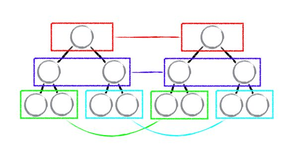
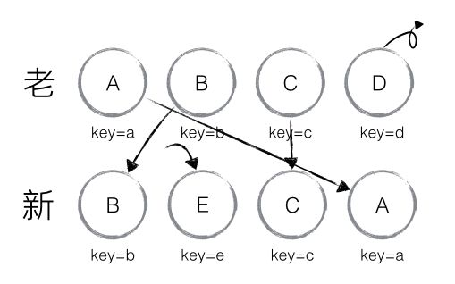

# 差异化算法

diff 算法作为 Virtual DOM 的加速器，其算法的改进优化是 React 整个界面渲染的基础和性能的保障，同时也是 React 源码中最神秘的，最不可思议的部分

diff 算法会帮助我们就算出 VirtualDOM 中真正变化的部分，并只针对该部分进行原生 DOM 操作，而不是渲染整个页面。从而保证了每次操作更新后页面的高效渲染。

## 传统算法

计算一棵树形结构转换为另一棵树形结构需要最少步骤，如果使用传统的 diff 算法通过循环递归遍历节点进行对比，其复杂度要达到 **O(n^3)**，其中 n 是树中节点总数，效率十分低下，假设我们要展示 1000 个节点，那么我们就要依次执行上十亿次的比较。

```js
// Traditional Diff Algorithm
let res = [];
// 比较子节点
const diffLeafs = function(beforeLeaf, afterLeaf) {
  // 获取较大节点树的长度
  let count = Math.max(beforeLeaf.children.length, after.children.length);
  // 循环遍历
  for (let i = 0; i < count; i++) {
    const beforeTag = beforeLeaf.children[i];
    const afterTag = afterLeaf.children[i];
    if (beforeTag === undefined) {
      // 添加 afterTag 节点
      res.push({ type: 'add', element: afterTag });
    } else if (afterTag === undefined) {
      // 删除 beforeTag节点
      res.push({ type: 'remove', element: beforeTag });
    } else if (beforeTag.tagName !== afterTag.tagName) {
      // 节点名改变时,删除 beforeTag 节点,添加 afterTag 节点
      res.push({ type: 'remove', element: beforeTag });
      res.push({ type: 'add', element: afterTag });
    } else if (beforeTag.innerHTML !== afterTag.innerHTML) {
      if (beforeTag.children.length === 0) {
        res.push({
          type: 'changed',
          beforeElement: beforeTag,
          afterElement: afterTag,
          HTML: afterTag.innerHTML,
        });
      } else {
        // 递归比较
        diffLeafs(beforeTag, afterTag);
      }
    }
  }
  return res;
};
```

## 算法实现

React 将 Virtual DOM 树转换为 Actual DOM 的最少操作过程称为**调和**（Reconciliation），diff 算法便是调和的具体实现。

React 通过制定大胆的策略，将 **O(n^3)** 复杂度的问题转换成 **O(n)** 复杂度的问题。

首先需要明确，只有 React 更新阶段才会有 diff 算法的运用。

### 算法策略

- Web UI 中 DOM 节点跨层级的移动操作特别少，可以忽略不计
- 拥有相同类的两个组件将会生成相似的树形结构，拥有不同类的两个组件将会生成不同的树形结构。
- 对于同一层级的一组子节点，它们可以通过 UUID（key）进行区分。

基于以上三个前提策略，React 分别对 **Tree Diff**、**Component Diff**、**Element Diff** 进行算法优化，事实也证明这三个前提策略是合理且准确的，它保证了整体界面构建的性能。

### 算法粒度

#### Tree Diff

Tree Diff 即对树进行逐层对比的过程，两棵树只会对**同层次的节点**进行比较。

既然 WebUI 中的 DOM 节点跨层级的移动操作少到可以忽略不计，针对这一现象，React 通过 updateDepth 对 Virtual DOM 树进行层级控制，只会对相同颜色方框内的 DOM 节点进行比较，即同一个父节点下的所有子节点。当发现节点已经不存在，则该节点及其子节点会被完全删除掉，不会用于进一步的比较。这样只需要对树进行一次遍历，便能完成整个 DOM 树的比较。



**Question：当 DOM 节点进行跨层级操作时，diff 会有怎样的表现呢？**

**原理剖析：**

如下图所示，A 节点（包括其子节点）被整个移动到 D 节点下面去，由于 React 只会简单的考虑**同级节点**的位置变换，而对于不同层级的节点，只有创建和删除操作，所以当根节点发现 A 节点消失了，就会删除 A 节点及其子节点，当 D 发现多了一个子节点 A，就会创建新的 A 作为其子节点。

此时，diff 算法的执行情况是：**create A => create B => create C => delete A**


由此可见，当出现节点跨层级的移动时，并不会出现想象中移动操作，而是会进行删除，重新创建的动作，这是一种很影响 React 性能的操作。因此 **React 官方也不建议进行 DOM 节点跨层级的操作。**

> 提示：在开发组件时，保持稳定的 DOM 结构会有助于性能的提升。例如，可以通过 CSS 隐藏或显示节点，而不是真的移除或添加 DOM 节点。

#### Component Diff

在进行 Tree Diff 过程中，每层组件级别的对比，叫做 Component Diff。

- 如果对比前后，组件的类型相同，则按照原策略继续进行 Virtual DOM 比较
- 如果对比前后，组件的类型不相同，则需要移除旧组件，创建新组件，并追加到页面上

如果是同类型的组件，有可能经过一轮 Virtual DOM 比较下来，并没有发生变化。如果我们能够提前确切知道这一点，那么就可以省下大量的 diff 运算时间。因此，React 允许用户通过 `shouldComponentUpdate` 来判断该组件是否需要进行 diff 算法分析

如下图所示， 当 component D 变为 component G 时，即使这两个 component 结构相似，一旦 React 判断 D 和 G 是不同类型的组件，就不会比较两者的结构，而是直接删除组件 component D，重新创建 component G 及其子节点。虽然当两个组件是不同类型但结构相似时，进行 diff 算法分析会影响性能，但是毕竟不同类型的组件存在相似 DOM 树的情况在实际开发过程中很少出现，因此这种极端因素很难在实际开发过程中造成重大影响。


#### Element Diff

在进行组件对比的时候，如果两个组件类型相同，则需要进行元素级别的对比，这叫做 Element Diff。

Element Diff 对应三种节点操作，分别为 **`INSERT_MARKUP`（插入）**、**`MOVE_EXISTING`（移动）** 和 **`REMOVE_NODE`（删除）**。

- **`INSERT_MARKUP`**：新的组件类型不在旧集合中，即全新的节点，需要对新节点进行插入操作。
- **`MOVE_EXISTING`**：旧集合中有新组件类型，且 `element` 是可更新的类型，generateComponent 已调用 recevieComponent，这种情况下 `prevChild = nextChild`，这时候就需要做移动操作，可以复用以前的 DOM 节点。
- **`REMOVE_NODE`**：旧组件类型，在新集合里也有，但对应的 `element` 不同则不能直接复用和更新，需要执行删除操作，或者旧组件不在新集合里的，也需要执行删除操作。

如下图，老集合中包含节点：A、B、C、D，更新后的新集合中包含节点：B、A、D、C，此时新老集合进行 diff 差异化对比，发现 B != A，则创建并插入 B 至新集合，删除老集合 A；以此类推，创建并插入 A、D 和 C，删除 B、C 和 D。


React 发现这类操作繁琐冗余，因为这些都是相同的节点，但由于位置发生变化，导致需要进行繁杂低效的删除、创建操作，其实只要对这些节点进行位置移动即可。

针对这种情况，React 提出优化策略：**允许开发者对同一层级的同组子节点，添加唯一 key 进行区分**，虽然只是小小的改动，性能上却发生了翻天覆地的变化。

新老集合所包含的节点，如下图所示，新老集合进行 diff 差异化对比，通过 key 发现新老集合中的节点都是相同的节点，因此无需进行节点删除和创建，只需要将老集合中节点的位置进行移动，更新为新集合中节点的位置，此时 React 给出的 diff 结果为：B、D 不做任何操作，A、C 进行移动操作，即可。



那么，如此高效的 diff 到底是如何运作的呢？让我们通过源码进行详细分析。

先搞清楚 3 个 index 索引：

* nextId：遍历 nextChildren 时候的 index，每遍历一个元素加 1
* lastIndex：默认为 0，表示上次从 prevChildren 中取出元素时，这个元素在 prevChildren 中的 index
* _mountIndex：元素在数组中的位置

**element diff 逻辑概括**

首先对新集合的节点进行循环遍历，`for (name in nextChildren)`，通过唯一 key 可以判断新老集合中是否存在相同的节点，`if (prevChild === nextChild)`。

如果存在相同节点，则进行**移动操作**，但在移动前需要将当前节点在老集合中的位置与 lastIndex 进行比较，`if (child._mountIndex < lastIndex)`，则进行节点移动操作，否则不执行该操作。

这是一种顺序优化手段，lastIndex 一直在更新，表示访问过的节点在老集合中最右的位置（即最大的位置），如果新集合中当前访问的节点比 lastIndex 大，说明当前访问节点在老集合中就比上一个节点位置靠后，则该节点不会影响其他节点的位置，因此不用添加到差异队列中，即不执行移动操作，只有当访问的节点比 lastIndex 小时，才需要进行移动操作。

**element diff 差异对比过程**

以上图为例，可以更为清晰直观的描述 diff 的差异对比过程：

- 从新集合中取得 B，判断老集合中存在相同节点 B，通过对比节点位置判断是否进行移动操作
  - **判断过程**：B 在老集合中的位置 `B._mountIndex = 1`，此时 `lastIndex = 0`(首次遍历时默认为 0)，不满足`child._mountIndex < lastIndex` 的条件，因此不对 B 进行移动操作
  - **更新索引**：更新 `lastIndex = Math.max(prevChild._mountIndex, lastIndex)`，其中 `prevChild._mountIndex` 表示 B 在老集合中的位置，则 `lastIndex ＝ 1`，并将 B 的位置更新为新集合中的位置 `prevChild._mountIndex = nextIndex`，此时新集合中 `B._mountIndex = 0`，`nextIndex++` 进入下一个节点的判断。
- 从新集合中取得 A，判断老集合中存在相同节点 A，通过对比节点位置判断是否进行移动操作
  - **判断过程**：A 在老集合中的位置 `A._mountIndex = 0`，此时 `lastIndex = 1`，满足 `child._mountIndex < lastIndex` 的条件，因此对 A 进行移动操作 `enqueueMove(this, child._mountIndex, toIndex)`，其中 `toIndex` 其实就是 `nextIndex`，表示 A 需要移动到的位置
  - **更新索引**：更新 `lastIndex = Math.max(prevChild._mountIndex, lastIndex)`，则 `lastIndex ＝ 1`，并将 A 的位置更新为新集合中的位置 `prevChild._mountIndex = nextIndex`，此时新集合中 `A._mountIndex = 1`，`nextIndex++` 进入下一个节点的判断。
- 从新集合中取得 D，判断老集合中存在相同节点 D，通过对比节点位置判断是否进行移动操作
  - **判断过程**：D 在老集合中的位置 `D._mountIndex = 3`，此时 `lastIndex = 1`，不满足 `child._mountIndex < lastIndex` 的条件，因此不对 D 进行移动操作
  - **更新索引**：更新 `lastIndex = Math.max(prevChild._mountIndex, lastIndex)`，则 `lastIndex ＝ 3`，并将 D 的位置更新为新集合中的位置 `prevChild._mountIndex = nextIndex`，此时新集合中 `D._mountIndex = 2`，`nextIndex++` 进入下一个节点的判断。
- 从新集合中取得 C，判断老集合中存在相同节点 C，通过对比节点位置判断是否进行移动操作
  - **判断过程**：C 在老集合中的位置 `C._mountIndex = 2`，此时 `lastIndex = 3`，满足 `child._mountIndex < lastIndex` 的条件，因此对 C 进行移动操作 `enqueueMove(this, child._mountIndex, toIndex)`
  - **更新索引**：更新 `lastIndex = Math.max(prevChild._mountIndex, lastIndex)`，则 `lastIndex ＝ 3`，并将 C 的位置更新为新集合中的位置 `prevChild._mountIndex = nextIndex`，此时新集合中 `C._mountIndex = 3`，`nextIndex++` 进入下一个节点的判断，由于 C 已经是最后一个节点，因此 diff 到此完成。

以上主要分析新老集合中存在相同节点但位置不同时，对节点进行位置移动的情况，如果新集合中有新加入的节点且老集合存在需要删除的节点，那么 React diff 又是如何对比运作的呢？


以上图为例：

- 从新集合中取得 B，判断老集合中存在相同节点 B
  - **判断过程**：由于 B 在老集合中的位置 `B._mountIndex = 1`，此时`lastIndex = 0`，因此不对 B 进行移动操作
  - **更新索引**：更新 `lastIndex ＝ 1`，并将 B 的位置更新为新集合中的位置`B._mountIndex = 0`，`nextIndex++` 进入下一个节点的判断。
- 从新集合中取得 E，判断老集合中不存在相同节点 E，则创建新节点 E
  - **更新索引**：更新 `lastIndex ＝ 1`，并将 E 的位置更新为新集合中的位置，`nextIndex++` 进入下一个节点的判断。
- 从新集合中取得 C，判断老集合中存在相同节点 C
  - **判断过程**：由于 C 在老集合中的位置 `C._mountIndex = 2`，`lastIndex = 1`，此时 `C._mountIndex > lastIndex`，因此不对 C 进行移动操作
  - **更新索引**：更新 `lastIndex ＝ 2`，并将 C 的位置更新为新集合中的位置，`nextIndex++` 进入下一个节点的判断。
- 从新集合中取得 A，判断老集合中存在相同节点 A
  - **判断过程**：由于 A 在老集合中的位置 `A._mountIndex = 0`，`lastIndex = 2`，此时 `A._mountIndex < lastIndex`，因此对 A 进行移动操作
  - **更新索引**：更新 `lastIndex ＝ 2`，并将 A 的位置更新为新集合中的位置，`nextIndex++` 进入下一个节点的判断。
- 当完成新集合中所有节点 diff 时，最后还需要对老集合进行循环遍历，判断是否存在新集合中没有但老集合中仍存在的节点，发现存在这样的节点 D，因此删除节点 D，到此 diff 全部完成。

当然，React diff 还是存在些许不足与待优化的地方，如下图所示，若新集合的节点更新为：D、A、B、C，与老集合对比只有 D 节点移动，而 A、B、C 仍然保持原有的顺序，理论上 diff 应该只需对 D 执行移动操作，然而由于 D 在老集合的位置是最大的，导致其他节点的 _mountIndex < lastIndex，造成 D 没有执行移动操作，而是 A、B、C 全部移动到 D 节点后面的现象。


> 建议：在开发过程中，尽量减少类似将最后一个节点移动到列表首部的操作，当节点数量过大或更新操作过于频繁时，在一定程度上会影响 React 的渲染性能。

### 算法源码

```js
_updateChildren: function(nextNestedChildrenElements, transaction, context) {
    var prevChildren = this._renderedChildren;
    var removedNodes = {};
    var mountImages = [];

    // 获取新的子元素数组
    var nextChildren = this._reconcilerUpdateChildren(
      prevChildren,
      nextNestedChildrenElements,
      mountImages,
      removedNodes,
      transaction,
      context
    );

    if (!nextChildren && !prevChildren) {
      return;
    }

    var updates = null;
    var name;
    var nextIndex = 0;
    var lastIndex = 0;
    var nextMountIndex = 0;
    var lastPlacedNode = null;

    for (name in nextChildren) {
      if (!nextChildren.hasOwnProperty(name)) {
        continue;
      }
      var prevChild = prevChildren && prevChildren[name];
      var nextChild = nextChildren[name];
      if (prevChild === nextChild) {
        // 同一个引用，说明是使用的同一个component,所以我们需要做移动的操作
        // 移动已有的子节点
        // NOTICE：这里根据nextIndex, lastIndex决定是否移动
        updates = enqueue(
          updates,
          this.moveChild(prevChild, lastPlacedNode, nextIndex, lastIndex)
        );

        // 更新lastIndex
        lastIndex = Math.max(prevChild._mountIndex, lastIndex);
        // 更新component的.mountIndex属性
        prevChild._mountIndex = nextIndex;

      } else {
        if (prevChild) {
          // 更新lastIndex
          lastIndex = Math.max(prevChild._mountIndex, lastIndex);
        }

        // 添加新的子节点在指定的位置上
        updates = enqueue(
          updates,
          this._mountChildAtIndex(
            nextChild,
            mountImages[nextMountIndex],
            lastPlacedNode,
            nextIndex,
            transaction,
            context
          )
        );


        nextMountIndex++;
      }

      // 更新nextIndex
      nextIndex++;
      lastPlacedNode = ReactReconciler.getHostNode(nextChild);
    }

    // 移除掉不存在的旧子节点，和旧子节点和新子节点不同的旧子节点
    for (name in removedNodes) {
      if (removedNodes.hasOwnProperty(name)) {
        updates = enqueue(
          updates,
          this._unmountChild(prevChildren[name], removedNodes[name])
        );
      }
    }
  }
```

## 更新渲染

### 合并操作

当调用 component 的 setState 方法的时候，React 将其标记为 dirty，到每一个事件循环结束，React 检查所有标记 dirty 的 component 重新绘制。

这里的**合并操作**是指，在一个事件循环当中，DOM 只会被更新一次，这个特性是构建高性能应用的关键，而且用通常的 JavaScript 代码难以实现，而在 React 应用里，你默认就能实现。


### 子树渲染

调用 `setState` 方法时，component 会重新构建包括子节点的 Virtual DOM。如果你在根节点调用 `setState`，整个 React 的应用都会被重新渲染。所有的 component 即便没有更新，都会调用他们的 `render` 方法。这个听起来可怕，性能貌似很低，但实际上我们不会触碰真实的 DOM，运行起来没那样的问题。

首先，我们讨论的是展示用户界面。因为屏幕空间有限，通常你需要一次渲染成百上千条指令，JavaScript 对于能处理的整个界面，在业务路基上已经足够快了。

令一点，在写 React 代码时，每当有数据更新，你不是都调用根节点的 `setState`。你会在需要接收对应更新的 component 上调用，或者在上面的几个 component。你很少要一直在根节点上，就是说界面更新只出现在用户产生交互的局部。


### 选择性子树渲染

最后，你还有可能去掉一些子树的重新渲染。如果你在 component 上实现以下方法的话：

```js
boolean shouldComponentUpdate(object nextProps, object nextState)
```

根据 component 的前一个和下一个 `props/state`，你可以告诉 React 这个 component 没有更新，也不需要重新绘制，实现得好的话，可以带来巨大的性能提升。

要用这个方法，你要能够对 JavaScript Object 进行比对，这样有很多细节的因素，比如对比应该是深度的还是浅层的。如果要深的，我们是用不可变数结构，还是进行深度拷贝。

而且你要注意，这个函数每次都会被调用，所以你要确保运行起来花的时间更少，比 React 的做法时间少，还有比计算 component 需要的时间少，即使重新绘制并不是必要的。


## 总结

- React 通过制定大胆的 diff 策略，将 _O(n^3)_ 复杂度的问题转换成 _O(n)_ 复杂度的问题
- React 通过分层求异的策略，对 tree diff 进行算法优化
- React 通过相同类生成相似树形结构，不同类生成不同树形结构的策略，对 component diff 进行算法优化
- React 通过设置唯一 key 的策略，对 element diff 进行算法优化
- 建议，在开发过程中，保持稳定的 DOM 结构会有助于性能的提升
- 建议，在开发过程中，尽量减少类似将最后一个节点移动到列表首部的操作，当节点数量过大或更新操作过于频繁时，在一定程度上会影响 React 的渲染性能

## 结论

帮助 React 变快的技术并不新颖，长久以来，我们知道触碰 DOM 是费时的，你应该合并处理读和写的操作，事件代理会更快。

人们还是会经常讨论他们，因为在实际当中用 JavaScript 进行实现还是挺难的，React 突出的一个原因是这些优化默认就启动了，这就让你避免掉不小心把 App 写得很慢。

React 消耗性能的模型很简单，很好理解：每次调用 `setState` 会重新计算整个子树。如果你想要提高性能，尽量少调用 `setState`，还有用 `shouldComponentUpdate` 减少大的子树的重新计算。


总结一下 Diff 算法的大致流程：

1. 又一个全局变量 updateDepth 来标识递归的深度，进行 diff 算法之前 +1，diff 算法结束之后 -1。当其重新变为0的时候表示整个 diff 算法结束了，可以拿更新队列 diffQueue 来更新 DOM 了
2. Diff 算法只对同个父元素的同级子元素进行对比。如果元素的 type 和 key（如果有的话）相同，视为同一个元素，进行更新；否则替换掉。
3. Diff 使用了一个局部变量：`lastIndex` ——记录已经处理的就列表中最靠后的元素。当元素的 `._mountIndex` 大于 `lastIndex` 的时候，不需要移动元素。因为移动元素不会对前面对元素产生任何影响，因此可以省略这个动作，由于很多时候大部分元素处于这种情况下，因此这个局部变量提升了性能（有时候很明显）。
需要注意的是如果把列表中最后一个元素移到最前面，那么 `lastIndex` 就会大于后面对比的所有元素，导致的后果就是列表中所有元素都将被移动。

---

**参考资料：**

- [📝 React 源码剖析系列——不可思议的 react diff](https://zhuanlan.zhihu.com/p/20346379)
- [📝 React Diff 算法浅析](https://blog.csdn.net/qq_26708777/article/details/78107577?utm_source=blogxgwz6)
- [📝 React 的 diff 算法](https://segmentfault.com/a/1190000000606216)
- [📝 React 源码分析——Diff 算法](https://juejin.im/post/5aa163df518825557b4c4f0a)
- [📝 Virtual DOM 的原理与实现](https://www.bilibili.com/video/av41341063?from=search&seid=4225014166530473905)
- [📝 谈谈React中 Diff 算法的策略及实现](https://segmentfault.com/a/1190000016539430)


React 源码深度解读：Diff 算法详解
https://segmentfault.com/a/1190000017039293

从React渲染流程分析Diff算法
https://www.ctolib.com/topics-134765.HTML